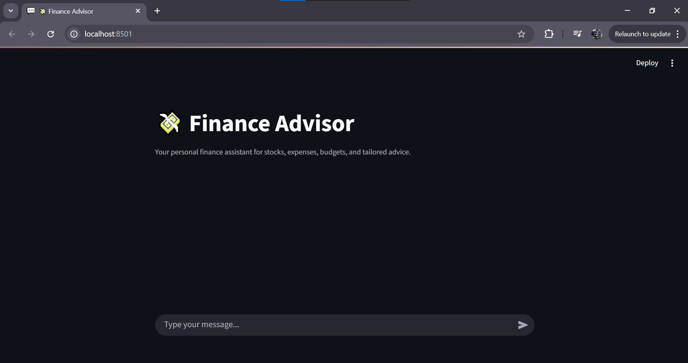

# Finance Advisor - Personal Finance Assistant

## Overview
Finance Advisor is a Streamlit-based AI-powered finance assistant designed to simplify personal finance management. It enables users to track expenses, access real-time stock information via the Alpha Vantage API, view budget summaries, and receive personalized financial advice through a conversational interface. Powered by LangGraph and the Groq API, Finance Advisor maintains user context across sessions, provides empathetic and clear responses, and includes a Human-in-the-Loop (HITL) mechanism for high-risk queries. 

## Features
* **User Profile Collection:** Gathers user details (age, income, goals, risk tolerance) for tailored responses. 
* **Real-Time Stock Data:** Fetches stock prices using Alpha Vantage API with robust symbol extraction and error handling. 
* **Intent Detection:** Classifies queries into profile updates, stock queries, expense tracking, budget summaries, or advice. 
* **Memory Management:**
    Short-term memory for in-session context (e.g., previous intents). 
    Long-term memory for cross-session continuity (e.g., past advice). 
* **Human-in-the-Loop (HITL):** Flags high-risk queries (e.g., "liquidate retirement account") for simulated human review. 
* **Empathetic Responses:** Uses clear, jargon-free language for users with limited financial literacy. 
* **Debugging:** Includes logging to troubleshoot API issues. 

## Prerequisites
* **Python:** Version 3.8 or higher. 
* **Virtual Environment:** Recommended to isolate dependencies. 
* **API Keys:**
    Groq API key (for LLM). 
    Alpha Vantage API key (for stock data). 

## Setup Instructions
* **Clone the Repository (if applicable):**
    git clone <repository-url>
    cd finadvise
* **Create Virtual Environment:**
    Create a virtual environment named venv:
    python3 -m venv venv
- Activate Virtual Environment:

- On macOS/Linux:source env4/bin/activate

- On Windows:env4\Scripts\activate

- Install Dependencies:Install required packages from requirements.txt:
    pip install -r requirements.txt

- Contents of requirements.txt:
    streamlit>=1.30.0
    langchain>=0.1.14
    langchain_groq>=0.1.4
    langgraph>=0.0.35
    python-dotenv>=1.0.0
    requests>=2.31.0

- Set Up Environment Variables: Create a .env file in the project root with your API keys:
    GROQ_API_KEY=<your-groq-api-key>
    ALPHA_VANTAGE_API_KEY=<your-alpha-vantage-api-key>

- Run the Application:Start the Streamlit app:
    -streamlit run app.py

- Access the app at http://localhost:8501 in your browser.

- Deactivate Virtual Environment (when done):
    deactivate

## Usage
- Interface: Use the chat-based UI to:
    Check stock prices (e.g., "What’s the price of AAPL stock?").
    Track expenses (e.g., "Add $50 for groceries").
    Request budget summaries (e.g., "Show my budget").
    Seek financial advice (e.g., "How should I save for a house?").
    Share profile details (e.g., "I’m 30 and earn $50,000").

- Example Prompt:What’s a good budget plan for someone my age who earns $50,000 a year and wants to save for a car?

- High-Risk Queries: Queries like "Should I liquidate my retirement account?" trigger a simulated HITL response.

## Project Structure
finadvise/
├── env4/                   # Virtual environment directory
├── .env                    # Environment variables (API keys)
├── app.py                  # Main Streamlit application
├── requirements.txt        # Python dependencies
├── README.md               # Project overview and setup
├── FinAdvise_Documentation.md  # Detailed documentation
└── .gitignore              # Excludes env4/, .env

- Notes:
- Stock Data: Uses Alpha Vantage API for real-time stock prices. Free tier limits to 5 calls/minute; monitor usage or upgrade for higher limits.
- Debugging: Check terminal logs for API response details or errors (e.g., rate limits, invalid symbols).
- Security: Store API keys in .env to avoid hardcoding.
- Troubleshooting:
    Verify API keys in .env.
    Ensure internet connectivity for Alpha Vantage API.
- Upgrade pip if dependency issues arise: python -m pip install --upgrade pip.